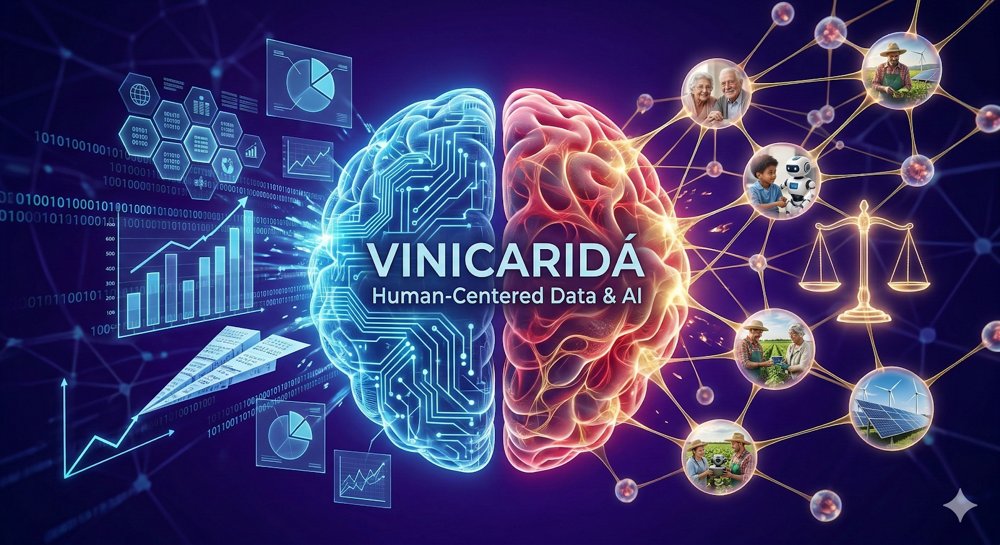

# 🧠 Vinicius Caridá, Ph.D.
### Executive Specialist in Data & AI | Computer Engineer | ML Expert

  
  
  
  
  

  <em>"Using Tech, Data & AI to leverage business and impact people for a more fair and evolved world."</em> 
  <small><i>"Do. Or do not. There is no try." — Applying the Jedi mindset to deploying ML models in production.</i></small>

---

## 🚀 About Me

With over 18 years of experience in IT and artificial intelligence, I hold both a Master's and a PhD in Computer Science, specializing in AI. I currently hold the position of Executive Specialist in Data and AI at Itaú Unibanco, while also teaching MBA programs in machine learning, data science, and business intelligence at FIAP and ESPM.

My technical expertise spans generative AI, natural language processing, virtual assistants, chatbots, recommendation engines, control systems, and the entire MLOps lifecycle. I am honored to be recognized as an AWS Machine Learning Hero, Google Developer Expert in machine learning, and Google Champion Innovator. Additionally, I contribute as an advisor and mentor for Google Startups.

I have contributed to the AI community as a Microsoft MVP in AI (2021-2022), and I currently lead AWS and Machine Learning/TensorFlow user groups in São Paulo. As Co-Chair of the LatinX in AI (LXAI) workshops at prestigious international conferences like AAAI, ICML, and NeurIPS, I remain committed to fostering diversity in AI research.

As a TEDx speaker and presenter at national and international events, I am passionate about sharing my knowledge and driving discussions on AI's role in creating fairer and more innovative global solutions. My work is grounded in the belief that AI and data have the power to transform industries and improve lives.

### 🏆 Technical Authority & Global Designations

  
  
  
  

---

## 🔬 Featured Research

* **BERTau Model:** Co-author of **BERTau**, a foundational language architecture trained entirely from scratch for the financial domain. This model surpassed the state-of-the-art and reduced computational and MLOps loads by up to 66%.

   
  

---

## 📢 Featured Keynotes & Public Speaking

I regularly share insights on AI, cloud computing, and technology at premier national and international events. Here are two highlighted presentations:

<table width="100%">
  <tr>
    <td width="50%" valign="top">
      <h4>🎤 TEDx Talk</h4>
      
<strong>O Poder da Inteligência Artificial Generativa</strong> 
      <i>TEDx Jardim dos Seixas</i>

      
A captivating talk on how Generative AI is reshaping industries, democratizing technology, and redefining the collaboration between humans and machine intelligence.

      
    </td>
    <td width="50%" valign="top">
      <h4>☁️ AWS re:Invent</h4>
      
<strong>Scaling Generative AI in Production</strong> 
      <i>Las Vegas (Global Keynote/Session)</i>

      
Presented in the early days of GenAI to a massive crowd in Las Vegas. The session was so highly anticipated that it filled 4 rooms (2 main halls + 2 overflow rooms) and counted Jeff Barr (VP & Chief Evangelist of AWS) in the audience.

      
    </td>
  </tr>
</table>

---

## 🛠️ Tech Stack & Ecosystem

These are the droids and tools I use daily to bring balance to the data:

  <strong>Artificial Intelligence, NLP & Vision:</strong> 
  
  
  
  
  

  <strong>Cloud Infrastructure & MLOps:</strong> 
  
  
  
  

  <strong>Analytical Languages:</strong> 
  
  
  

---

## 📚 Community Mentorship & Featured Repositories

I dedicate a significant part of my journey to demystifying AI and empowering the community through Live Coding and hands-on repositories—always passing on what I have learned, like a true Jedi Master.

- 📘 [AWS-UGSP-ML-Zero-to-Hero](https://github.com/vfcarida/AWS-UGSP-ML-Zero-to-Hero): Foundational track for democratizing Machine Learning on AWS.
- 🗣️ [AWS-UGSP-NLP-Zero-to-Hero](https://github.com/vfcarida/AWS-UGSP-NLP-Zero-to-Hero): Practical focus on Natural Language Processing and sequential architectures.
- ☁️ [huggingface-sagemaker-workshop-series](https://github.com/vfcarida/huggingface-sagemaker-workshop-series): Adaptation for enterprise NLP pipelines at scale.
- ⚙️ [MLOPS_class](https://github.com/vfcarida/MLOPS_class): Simulated development environments, CI/CD for ML, and mathematical foundations.

---

## 📊 Dynamic Contribution Statistics

  
  

 

  

---

## 📝 Strategic Vision & Recent Publications

The strategic evolution in the era of autonomous systems requires continuous rethinking. Here are some of my recent insights:

- 🔗 [Quando a coordenação entre múltiplos agentes realmente é necessária?](https://www.linkedin.com/pulse/quando-coordena%25C3%25A7%25C3%25A3o-entre-m%25C3%25BAltiplos-agentes-realmente-e-carid%25C3%25A1-ph-d--tutxf/?trackingId=gByqsee%2BLiiLdEufF9yC8Q%3D%3D) *(LinkedIn Pulse)*
- 🔗 [Do MLOps Tradicional à Engenharia de IA Generativa](https://www.linkedin.com/pulse/do-mlops-tradicional-%25C3%25A0-engenharia-de-ia-generativa-e-carid%25C3%25A1-ph-d--5ki3f/?trackingId=rdOpj2IpQeBAOcNP6aTdrw%3D%3D) *(LinkedIn Pulse)*
- 🔗 [Delegação Inteligente em Sistemas de Agentes: O que é?](https://www.linkedin.com/pulse/delega%25C3%25A7%25C3%25A3o-inteligente-em-sistemas-de-agentes-o-que-e-carid%25C3%25A1-ph-d--6khef/?trackingId=mpNQJNA4pULgxrzgqRUK0w%3D%3D) *(LinkedIn Pulse)*
- 🔗 [Guia Estratégico Para Arquitetura de Memória em IA](https://www.linkedin.com/pulse/guia-estrat%25C3%25A9gico-para-arquitetura-de-mem%25C3%25B3ria-em-ia-carid%25C3%25A1-ph-d--wu1ff/?trackingId=038Iz7zDjlaKMrT0lLvW7A%3D%3D) *(LinkedIn Pulse)*
- 🔗 [Nested Learning: A New Paradigm for Continual Machine Learning](https://medium.com/@vfcarida) *(Medium)*

---

  <i>If you want to discuss the integration between academia, market, and AI development—or simply debate the best Star Wars trilogy—let's connect on <a href="https://www.linkedin.com/in/viniciuscarida/">LinkedIn</a>!</i>

